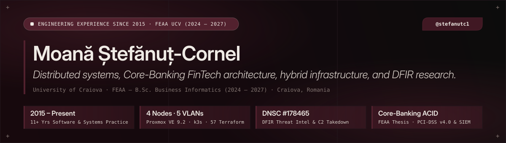

<div align="center">
  <a href="https://stefanutc1.github.io">
    
  </a>
</div>

<br />

<div align="center">

[](https://stefanutc1.github.io)
[](https://github.com/stefanutc1/infrastructure)
[](https://github.com/stefanutc1/proiecte)
[](https://github.com/stefanutc1/old)

</div>

---

### `[01]` · Executive Profile

I am **Moană Ștefănuț-Cornel** (`@stefanutc1`), an Information Systems Engineer, Hybrid Infrastructure Architect, and Applied Cybersecurity Researcher (**DFIR & Threat Intelligence**), currently pursuing a **B.Sc. in Business Informatics at the University of Craiova — Faculty of Economics and Business Administration (FEAA, `2024 – 2027`)**.

My software engineering journey began in **2015**, building concurrent multiplayer server architectures, custom server-side anti-cheat engines, and relational MySQL schemas from scratch (preserved in the [`stefanutc1/old`](https://github.com/stefanutc1/old) historical archive). Across more than a decade of continuous hands-on practice (**2015 – Present**), that foundation has evolved into three primary engineering pillars:

- **Mission-Critical Financial Systems (Bachelor's Thesis @ FEAA)**: Designing and hardening a full-stack **Core-Banking & Payment Gateway Platform** featuring a **PostgreSQL ACID Double-Entry Accounting Ledger** (`SELECT ... FOR UPDATE` pessimistic locking & `SERIALIZABLE` isolation), **Java 17 (Spring Boot 3.2)** microservices, **PCI-DSS v4.0** tokenization, a **Python FastAPI** real-time fraud scoring engine, and **Wazuh SIEM** detection validated against **5 MITRE ATT&CK scenarios**.
- **Digital Forensics & Incident Response (DFIR) & Threat Intelligence**: Reverse-engineering multi-stage phishing kits (e.g., *Media Galaxy / `yiyangsaas.com`*), dissecting **Browser-in-the-Middle (BitM)** OAuth/OpenID hijacks (*Steam*) and real-time operator vishing relays (*Revolut OTP Relay*), and coordinating official **National Cybersecurity Directorate (DNSC) takedowns (`#178465`)**.
- **Bare-Metal Datacenter & Hybrid Cloud Engineering**: Operating a self-hosted **4-node physical Homelab Datacenter** (`Proxmox VE 9.2`, `OpenMediaVault 7 NAS`, `Apple Silicon ARM64`, `Kubernetes k3s`), segmented across **5 Zero-Trust OPNsense 24.7 VLANs** and provisioned via **57 Terraform modules** and **18 Ansible roles**.

---

### `[02]` · Core Repositories & Systems Architecture (`2015 – 2027`)

| System ID | Repository & Live Portal | Timeline | Architecture & Technical Scope |
| :--- | :--- | :---: | :--- |
| **`SYS-WEB`** | **[`stefanutc1/stefanutc1.github.io`](https://github.com/stefanutc1/stefanutc1.github.io)**<br/>↳ 🌐 **[Live: stefanutc1.github.io](https://stefanutc1.github.io)** | `2026` | **Personal Presentation & Engineering Journal** built with **Next.js 15 (App Router, Static Export)**, featuring a bespoke `drivepoint.ro`-inspired UI/UX design system, interactive `zsh` shell, `⌘K` command palette, and **7 long-form bilingual (EN / RO) technical articles**. |
| **`SYS-INFRA`** | **[`stefanutc1/infrastructure`](https://github.com/stefanutc1/infrastructure)** | `2025 – Present` | **4-Node Hybrid Homelab Datacenter**: Proxmox VE 9.2 (`pve`, `pve2`), OpenMediaVault 7 NAS (`omv-nas`), Bare-Metal `k3s` (`kubernetes`), **OPNsense 24.7** (5 Zero-Trust VLANs), **57 Terraform files**, **18 Ansible roles**, **Wazuh SIEM/XDR**, **Suricata IDS/IPS**, and **ESP32** hardware telemetry firmware. |
| **`SYS-THESIS`** | **[`stefanutc1/proiecte`](https://github.com/stefanutc1/proiecte)** | `2024 – 2027` | **FEAA University Monorepo (43+ Projects) & Core-Banking Bachelor's Thesis**: Enterprise **Java 17 Spring Boot 3.2 + Angular 20 + PostgreSQL** banking platform, **DFIR Threat Intelligence dossiers** (*DNSC `#178465`*), **100% InvataCyber CTF writeups**, C++, C# .NET, Python, and Cisco Packet Tracer topologies. |
| **`SYS-OLD`** | **[`stefanutc1/old`](https://github.com/stefanutc1/old)** | `2015 – 2023` | **Historical Software Engineering Archive**: **RedZone SA-MP Roleplay** (`2015–2016`, PAWN & MySQL), **NQGaming SA-MP 0.3.7 RPG** (`2016–2018`, 10 factions, custom server-side anti-cheat), **Crowland Wiki** (`2019–2020`, Vue 3 & Vite), **Kronick Web Portal** (`2021–2023`, PHP/MySQL/Nginx), and **Roadman Discord Bot** (`2022–2023`, Python & Docker). |

---

### `[03]` · Engineering Journal & Featured Research on [`stefanutc1.github.io`](https://stefanutc1.github.io)

1. **`[POST-01]` · [DFIR Investigation of the "Media Galaxy" Phishing Campaign — From the `yiyangsaas.com` Kit to National DNSC Takedown `#178465`](https://stefanutc1.github.io)**  
   *Reverse-engineering the 8-step card & 3D-Secure OTP harvesting kit (`23.224.199.13`) and coordinating a national domain/IP takedown with the Romanian National Cybersecurity Directorate.*
2. **`[POST-02]` · [Architecting a Modern Core-Banking Platform: ACID Double-Entry Ledger, PCI-DSS v4.0 Compliance, and SIEM Detection](https://stefanutc1.github.io)**  
   *Deep dive into my FEAA Bachelor's Thesis: preventing `Lost Update` and `Double-Spending` race conditions in Spring Boot 3.2 and validating detection rules against 5 MITRE ATT&CK scenarios.*
3. **`[POST-03]` · [Building a 4-Node Bare-Metal Homelab Datacenter: Proxmox VE 9.2, 5-VLAN OPNsense Segmentation, and 57 Terraform Modules](https://stefanutc1.github.io)**  
   *Engineering my personal physical cluster (`192.168.1.240`, `.181`, `.196`, `.150`), ZRAM/KSM memory optimization, and GitOps automation.*
4. **`[POST-04]` · [Anatomy of Modern 2FA Bypass: Browser-in-the-Middle (BitM) on Steam OpenID vs. Real-Time Vishing Relays on Revolut](https://stefanutc1.github.io)**  
   *Comparative technical analysis of two advanced multi-factor authentication bypass paradigms and defensive detection strategies.*
5. **`[POST-05]` · [Decompiling a "Task Scam" Platform: `/api/v1/site/config` Manipulation, Psychological Engineering, and SQL Injection Exposure](https://stefanutc1.github.io)**  
   *Dissecting the backend API mechanics and database vulnerabilities of fraudulent "order optimization" platforms.*
6. **`[POST-06]` · [InvataCyber.ro 100% CTF Writeup: Exploiting Reflected XSS, Blind SQLi, Jinja2 SSTI, and Applied Cryptography](https://stefanutc1.github.io)**  
   *Full technical walkthrough of all Web Exploitation, Cryptography, and Linux Forensics challenges alongside remediation patterns.*
7. **`[POST-07]` · [From PAWN Scripts in 2015 to Enterprise Infrastructure: Over a Decade of Software Engineering (`stefanutc1/old`)](https://stefanutc1.github.io)**  
   *An engineering retrospective on the early systems built between 2015 and 2023 and how they shaped my current distributed systems architecture.*

---

### `[04]` · Homelab Datacenter Topology (`stefanutc1/infrastructure`)

```text
                         [ WAN / Cloudflare Zero-Trust Edge ]
                                          │
                        ┌─────────────────▼─────────────────┐
                        │   OPNsense 24.7 Firewall Router   │
                        │ 5 VLANs: MGMT·PROD·CYBER·NAS·IOT  │
                        └─┬──────────┬──────────┬─────────┬─┘
                          │          │          │         │
        ┌─────────────────▼─┐  ┌─────▼──────────▼─┐  ┌────▼────────────────┐
        │ NODE-1: pve       │  │ NODE-2: omv-nas  │  │ NODE-3 & NODE-4     │
        │ 192.168.1.240     │  │ 192.168.1.181    │  │ .196 (ARM64 pve2)   │
        │ Proxmox VE 9.2    │  │ OpenMediaVault 7 │  │ .150 (k3s Worker)   │
        │ 20+ VM/LXC · SIEM │  │ NFSv4/SMB3 · ZFS │  │ Cilium CNI · ESP32  │
        └───────────────────┘  └──────────────────┘  └─────────────────────┘
```

---

### `[05]` · Technology Stack Matrix (`2015 – Present`)

| Domain | Languages, Frameworks & Platforms |
| :--- | :--- |
| **Backend & Core Systems** | `Java 17` · `Spring Boot 3.2` · `Python 3.12` · `FastAPI` · `C / C++ (STL, POSIX)` · `C# (.NET 8)` · `PHP` · `PAWN` |
| **Frontend & Web Portals** | `TypeScript` · `Next.js 15 (React 19)` · `Angular 20` · `Vue 3 (Vite)` · `Tailwind CSS` · `HTML5 / SCSS` |
| **Datacenter, Cloud & IaC** | `Proxmox VE 9.2` · `Kubernetes (k3s / k0s)` · `Terraform (57 modules)` · `Ansible (18 roles)` · `Docker` · `Nginx` · `GitHub Actions CI/CD` |
| **Cybersecurity, DFIR & Net** | `Wazuh SIEM/XDR` · `Suricata IDS/IPS` · `OPNsense 24.7 (5 VLANs)` · `CrowdSec` · `WireGuard` · `YARA` · `MITRE ATT&CK` |
| **Databases & Storage** | `PostgreSQL 16 (ACID Ledger)` · `MySQL / MariaDB` · `Oracle SQL` · `SQLite` · `Redis` · `OpenMediaVault NAS (ZFS / NFSv4)` |

---

### `[06]` · Coordinates & Contact

- 🌐 **Personal Website & Engineering Blog**: [https://stefanutc1.github.io](https://stefanutc1.github.io)
- 🎓 **Academic Affiliation**: University of Craiova · Faculty of Economics and Business Administration (FEAA) — *B.Sc. in Business Informatics (`2024 – 2027`)*
- 📫 **Email**: [boostcroyale18@gmail.com](mailto:boostcroyale18@gmail.com)
- 📍 **Location**: Craiova, Romania
